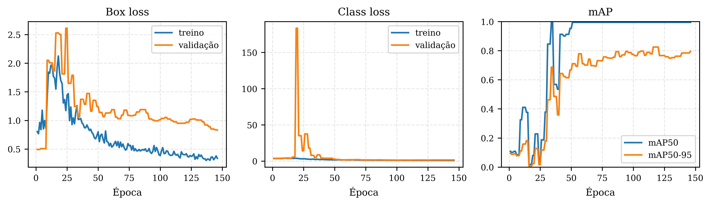
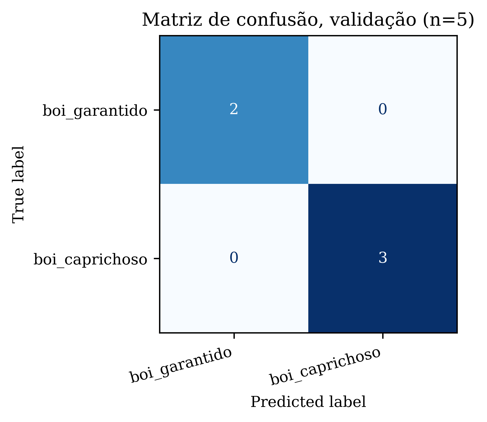
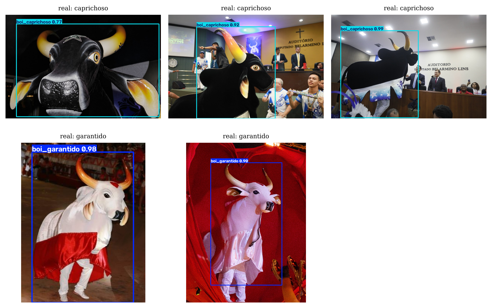

# Detecção de Objetos com YOLO: Boi Garantido x Boi Caprichoso

Desafio de código da [DIO](https://www.dio.me) sobre rotulagem de base de dados e treinamento da rede YOLO. Em vez do LabelMe e do Darknet original, usei uma stack mais atual, mas seguindo exatamente a mesma ideia pedida: pegar um detector pré-treinado no COCO e fazer transfer learning para reconhecer classes novas, que o modelo original nunca viu.

## O desafio

Rotular uma base de dados e treinar uma rede YOLO para detecção de objetos, com pelo menos duas classes novas além das já treinadas previamente. O enunciado aceita LabelMe mais Darknet, as imagens já rotuladas do COCO, ou transfer learning no Colab para quem não conseguir rodar a YOLO localmente. Optei por uma quarta via: [Ultralytics YOLOv8](https://github.com/ultralytics/ultralytics), o sucessor direto e mais usado hoje em dia da mesma família de redes, com pesos pré-treinados no COCO prontos para transfer learning local.

## As duas classes novas

`boi_garantido` e `boi_caprichoso`, as mascotes dos dois bois-bumbás do Festival de Parintins. Nenhuma das duas existe nas 80 classes do COCO. As imagens vieram do dataset já construído e curado no projeto [NeuralNetworks-TransferLearning](https://github.com/CROMA-LEARNING/NeuralNetworks-TransferLearning) deste mesmo portfólio, que originalmente foi feito para classificação, não detecção, complementadas com fotos novas mineradas especificamente para este projeto.

## Do dataset de classificação ao dataset de detecção

Aqui apareceu o primeiro problema real do projeto. O dataset de classificação inclui qualquer imagem relacionada ao time, torcida, bandeira, personagens individuais, sem exigir que o boi físico apareça na foto. Para detecção isso não serve: sem o objeto boi na imagem não existe caixa delimitadora para desenhar. Foi necessário filtrar, revisando visualmente as 225 imagens, quais mostram de fato a figura do boi, cabeça, estátua ou costume. Sobraram 56, 23 de Garantido e 33 de Caprichoso.

Com as imagens certas em mãos, faltava a caixa delimitadora em si, que o dataset original não tem. Em vez de rotular manualmente no LabelMe, usei o [rembg](https://github.com/danielgatis/rembg), que roda o modelo pré-treinado U2Net para segmentar o objeto principal da foto, e derivei a caixa a partir da máscara resultante. Uma forma de auto anotação fraca, bem mais rápida que rotular na mão.

O problema é que essa abordagem tem um viés conhecido: modelos de saliência genéricos, como o U2Net, são treinados majoritariamente com fotos de pessoas e tendem a marcar rostos e corpos humanos como o objeto mais saliente da cena, mesmo quando a intenção da foto é outra. Boa parte do dataset tem justamente isso, alguém posando ao lado da mascote, ou dançando com ela, e nesses casos o rembg com frequência marcou a pessoa, não o boi. Revisei manualmente as 56 caixas geradas e descartei todas em que a caixa não isolava razoavelmente a figura do boi. Sobraram 20 imagens, 7 de Garantido e 13 de Caprichoso.

Sete imagens de Garantido era pouco demais, então voltei a minerar. Encontrei uma segunda série de fotos do mesmo fotógrafo oficial do Festival, dessa vez dedicada à apresentação do Boi Garantido, e repeti o processo: baixar, gerar caixa com rembg, revisar manualmente aplicando o mesmo critério de sempre, o boi como elemento dominante da cena, sem pessoa competindo por atenção. De 53 fotos novas, só 4 passaram no critério. Fiz o mesmo para Caprichoso com uma leva menor, e mais 2 entraram. No fim o dataset foi de 20 para 26 imagens, 11 de Garantido e 15 de Caprichoso, divididas em 21 para treino e 5 para validação, com as duas classes representadas nos dois conjuntos. A taxa de aproveitamento baixa, a maioria das fotos novas também tinha gente em destaque perto do boi, reforça o mesmo achado sobre o viés do rembg.

## Treinamento

Fine-tuning do `yolov8n.pt`, a versão mais leve da família YOLOv8 pré-treinada no COCO.

A primeira tentativa, destravando a rede inteira, não convergiu de forma estável: o mAP oscilava violentamente entre épocas, de 0.33 para 0.02 e de volta para 0.35, sem tendência clara. Faz sentido, 21 imagens de treino é pouco para ajustar os milhões de parâmetros de todas as camadas convolucionais sem overfitar feio. A solução foi a mesma lição do projeto de Transfer Learning com a VGG16 deste portfólio: congelar o backbone pré-treinado e treinar só a cabeça de detecção, que tem muito menos parâmetros e converge de forma muito mais estável com pouco dado. Com o backbone congelado (`freeze=10`), learning rate mais baixo e mosaico desligado, o treino ficou estável e o mAP subiu de forma consistente ao longo das épocas.

```bash
python scripts/build_dataset.py   # gera dataset/images e dataset/labels a partir das listas aprovadas
python scripts/train.py           # fine-tuning do YOLOv8n, backbone congelado
python scripts/predict.py foto.jpg  # roda o detector treinado numa imagem nova
```

## Resultados



146 épocas até o early stopping. O melhor checkpoint, salvo automaticamente como `best.pt`, ocorreu na época 116: mAP50 de 0.995 e mAP50-95 de 0.825 no conjunto de validação, com precisão de 0.945 e recall de 0.990.



Rodando o `best.pt` nas 5 imagens de validação com limiar de confiança 0.4, mantendo só a detecção mais confiante por imagem: as 5 foram classificadas corretamente, 2 de Garantido e 3 de Caprichoso, com confiança entre 0.77 e 0.99.



## O que fica de aprendizado

Duas descobertas valeram mais que o número final do mAP. A primeira: anotação automática via segmentação de saliência genérica funciona bem para fotos de objeto único e centralizado, e falha de forma previsível quando há pessoas na cena competindo pela atenção do modelo de segmentação, uma limitação conhecida de pipelines de anotação fraca. A segunda: com um dataset muito pequeno, destravar a rede inteira para fine-tuning não é sempre a melhor forma de fazer transfer learning, às vezes o certo é justamente o oposto, congelar o máximo possível e deixar só uma parte pequena da rede aprender, exatamente o princípio clássico de transfer learning por extração de features, e a diferença entre um treino instável e um mAP de 0.99 foi essa mudança.

Para melhorar o detector ainda mais, o próximo passo natural é seguir a mesma estratégia que já funcionou duas vezes: minerar mais fotos onde o boi seja o elemento dominante da cena, em especial de Caprichoso, e opcionalmente rotular manualmente as imagens que o rembg errou, em vez de descartá-las.

## Créditos

- Modelo base: [YOLOv8n](https://github.com/ultralytics/ultralytics), Ultralytics, pré-treinado no COCO.
- Segmentação automática: [rembg](https://github.com/danielgatis/rembg), modelo U2Net.
- Imagens: reaproveitadas do dataset do projeto [NeuralNetworks-TransferLearning](https://github.com/CROMA-LEARNING/NeuralNetworks-TransferLearning), mais fotos novas do mesmo fotógrafo oficial do Festival de Parintins, Alberto César Araújo, via [Openverse](https://openverse.org), licença de domínio público.
